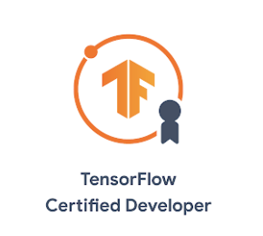

## Portfolio

---

### Class Presentation:

This is my presentation for a paper reading assignment in the Deep Learning For Computer Vision class.

Paper Title: [End to end object detection with transformers](https://arxiv.org/abs/2005.12872). Carion, N. et al. Facebook AI Research. ECCV 2020

[https://youtu.be/e6xp4AHLCVs](https://youtu.be/e6xp4AHLCVs)

---

### Human Activity Recognition using Deep Learning

ABLSTM model for Wifi CSI based Human Activity Recognition - [Report](pdf/HAR_Wifi_report.pdf)

I have attempted to reproduce the results in the WiFi CSI Based Passive Human Activity Recognition Using Attention Based BLSTM using a publicly available dataset. The process involves the re-implementation of the Attention Based Bidirectional Long Short Term Memory method in the original study. My algorithm’s results align with the claims in the original paper.

---

### Reproduce Unsupervised Domain Adaptation for Object Counting

This is my reimplementation of an Adversarial Domain adaption model for the task of object counting. This is a general domain adaptation framework and it could be applicable for other vision tasks as well.

[Github](https://github.com/bobvo23/DANN-Plant-Counting)

Paper Title: [Unsupervised Domain Adaptation for Plant Organ Counting](https://arxiv.org/abs/2009.01081). Ayalew, T.W. et al. ECCV 2020 Workshops

## 

---

### Low Yield Analysis Database

Award: Best Intern Project at the Intel Intern Projects Symposium 🌟🌟🌟

Developed a database application in C# and SQL for Intel Manufacturing Lab to assist engineers to keep track of High Valuable Inventory. Reduced missing items/violations by ~50%

---

### [Flicker Stimulator](https://github.com/bobvo23/flicker_stimulator) (25 stars - Github)

SSVEP Stimulator using MATLAB and Psychtoolbox

This is a 4 classes (or more) flickering stimulator for Steady State Evoked Potential experiment. The software generates four different target as can be seen in this video. [Youtube demo video](https://www.youtube.com/watch?v=HriCj1_7jdI) This tool presents a stable flickering frequencies which are usable for BCI applications.

---

### [WEEGEE Project](https://github.com/bobvo23/WEEG_SigPro)

[Master thesis](pdf/master_thesis.pdf)
This is the thesis project for my Master in Biomedical Engineering.

WEEG is a 24-bit 8-channel EEG system with integrated hardware and software interface. The device is based a new system-on-a-chip (SoC) to reduce circuitry components and be cost effective. Real-time view of 8-channel EEG data is also displayed.

### Publications

Vo T.T. (2017) Development And Evaluation of WEEG: A Wearable 8-Channel System for Brain Computer Interfaces. In: Goh J., Lim C., Leo H. (eds) The 16th International Conference on Biomedical Engineering. IFMBE Proceedings, vol 61. Springer, Singapore. [https://doi.org/10.1007/978-981-10-4220-1_14](https://doi.org/10.1007/978-981-10-4220-1_14)

Vo T.T., Nguyen N.P., Vo Van T. (2018) WEEGEE: Wireless 8-Channel EEG Recording Device. In: Vo Van T., Nguyen Le T., Nguyen Duc T. BME 2017. IFMBE Proceedings, vol 63. Springer, Singapore. [https://doi.org/10.1007/978-981-10-4361-1_106](https://doi.org/10.1007/978-981-10-4361-1_106)

Nguyen T.C., Huynh TQ., Vo TT., Nguyen P.N., Vo Van T. (2018) An EEG Front-End System Using ADS1299. In: Vo Van T., Nguyen Le T., Nguyen Duc T. BME 2017. IFMBE Proceedings, vol 63. Springer, Singapore. [https://doi.org/10.1007/978-981-10-4361-1_123](https://doi.org/10.1007/978-981-10-4361-1_123)

### Certificate

[AWS Machine Learning Specialty Certification](https://www.credly.com/badges/770736a5-2b30-4cf7-8ab9-6ba4b81188eb/public_url)

[TensorFlow Developer Certificate](pdf/tf_cert.pdf)

Event Speaker (Microsoft)

Cloud Platform Online: Modern Business Intelligence

### Honors-Awards

Intel Achievement Award, TMG, Divisional Recognition Award.

Intel Best Oral Presentation in Intern Projects symposium.

Intel National Scholarship (Top 3% students in the country)
